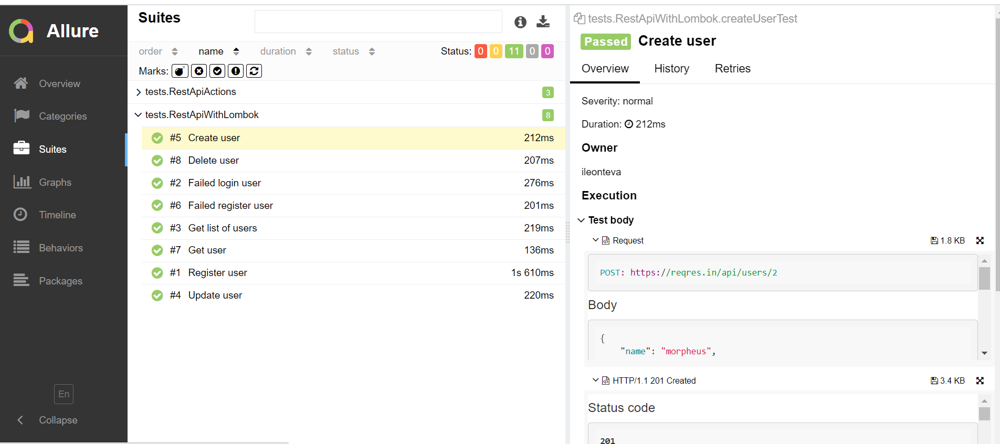
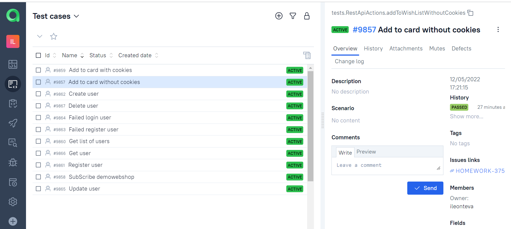
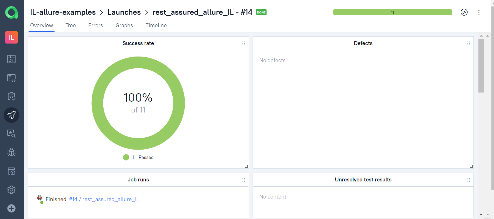
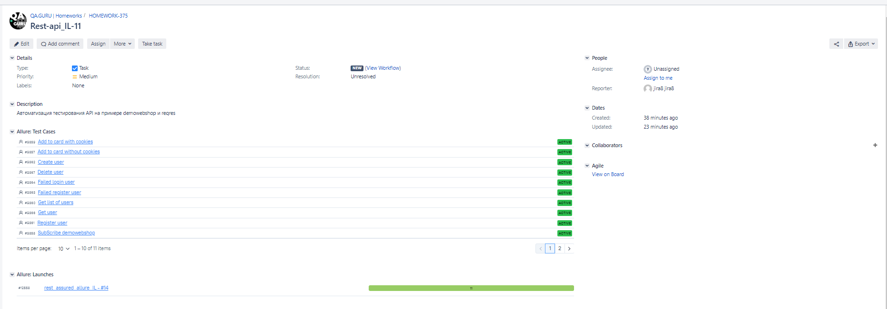
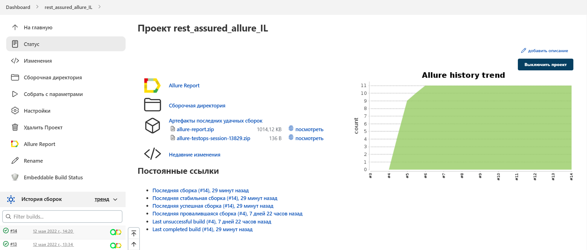
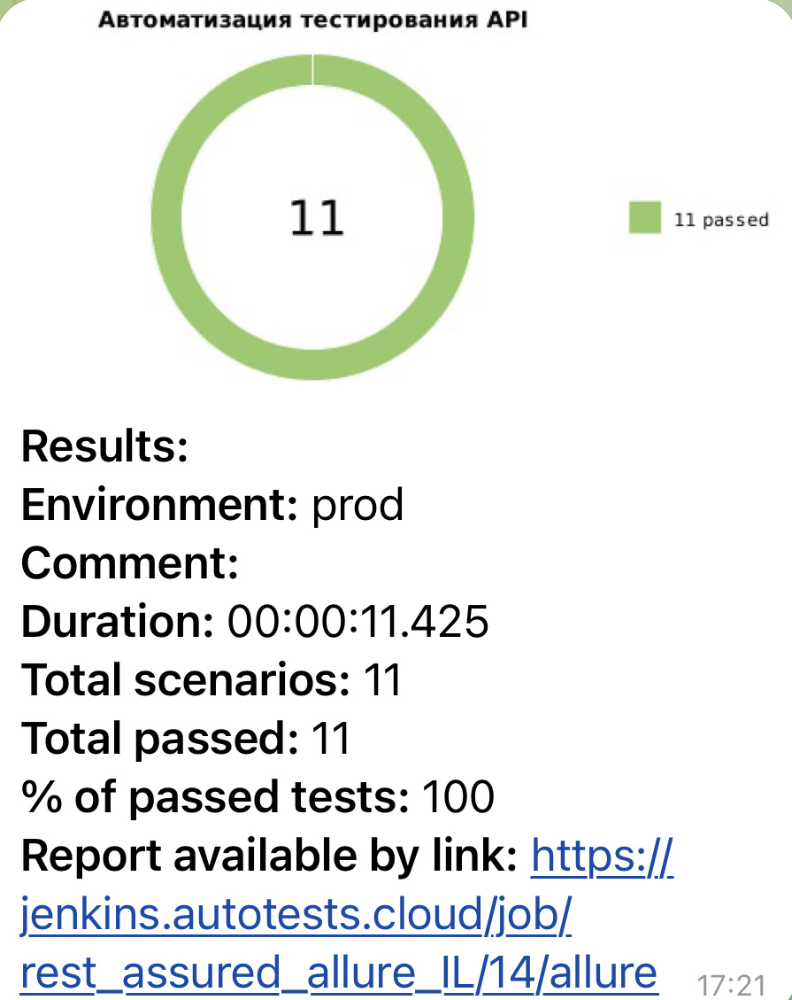

# API automation project для сайта [reqres.in](https://reqres.in/)

## Технологический стек:

| Java | Rest Assured | Gradle | Lombok | Junit5 | Jenkins | Telegram |
|:-----:|:-----:|:-----:|:-----:|:-----:|:-----:|:-----:|
|  |  |  |  |  |  |  |

[comment]: <> (## Используемые технологии и инструменты)

[comment]: <> (![Intelij_IDEA]&#40;src/images/icons/Intelij_IDEA.png&#41;)

[comment]: <> (![Java]&#40;src/images/icons/Java.png&#41;)

[comment]: <> (![Selenide]&#40;src/images/icons/Selenide.png&#41;)

[comment]: <> (![Selenoid]&#40;src/images/icons/Selenoid.png&#41;)

[comment]: <> (![Gradle]&#40;src/images/icons/Gradle.png&#41;)

[comment]: <> (![JUnit5]&#40;src/images/icons/JUnit5.png&#41;)

[comment]: <> (![Allure Report]&#40;src/images/icons/Allure_Report.png&#41;)

[comment]: <> (![AllureTestOps]&#40;src/images/icons/AllureTestOps.png&#41;)

[comment]: <> (![Github]&#40;src/images/icons/Github.png&#41;)

[comment]: <> (![Jenkins]&#40;src/images/icons/Jenkins.png&#41;)

[comment]: <> (![Rest-Assured]&#40;src/images/icons/Rest-Assured.png&#41;)

[comment]: <> (![Telegram]&#40;src/images/icons/Telegram.png&#41;)

[comment]: <> (![Jira]&#40;src/images/icons/Jira.png&#41;)

[comment]: <> (![Lombok]&#40;src/images/icons/Lombok.png&#41;)

## Реализованные проверки

- Успешная/неуспешная регистрация пользователя
- Получение пользователя
- Получение списка пользователей
- Обновление пользователя
- Создание пользователя
- Удаление пользователя
- Неуспешный логин пользователя

## Отчеты о прохождении тестов можно смотреть в Allure report

## Хранение тест-кейсов организовано в Allure TestOps

Обзор тестовых запусков:

## Настроена интеграция с Jira

## Удаленный запуск тестов возможен через - Jenkins job

Click <a target="_blank" href="https://jenkins.autotests.cloud/job/rest_assured_allure_IL/">here</a> to do that.

## Оповещение о прохождении тестов приходит в Telegram bot

Each test builds sent report into telegram bot

